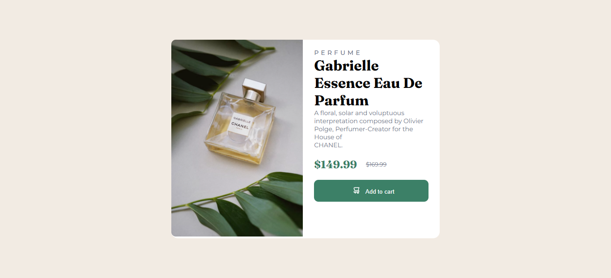

# Frontend Mentor - Product preview card component solution

This is a solution to the [Product preview card component challenge on Frontend Mentor](https://www.frontendmentor.io/challenges/product-preview-card-component-GO7UmttRfa). Frontend Mentor challenges help you improve your coding skills by building realistic projects. 

## Table of contents

- [Overview](#overview)
  - [The challenge](#the-challenge)
  - [Screenshot](#screenshot)
  - [Links](#links)
- [My process](#my-process)
  - [Built with](#built-with)
  - [What I learned](#what-i-learned)
  - [Continued development](#continued-development)
  - [Useful resources](#useful-resources)
- [Author](#author)

## Overview

### The challenge

Users should be able to:

- View the optimal layout depending on their device's screen size
- See hover and focus states for interactive elements

### Screenshot



### Links

- Solution URL: [Solution](https://your-solution-url.com)
- Live Site URL: [Live Site](https://your-live-site-url.com)

## My process

### Built with

- Semantic HTML5 markup
- CSS custom properties
- Flexbox
- Mobile-first workflow

### What I learned

I've learned how to use the ```<section>``` tag in HTML. With it, we can set media queries for different type of images withou creating divs that load, but are invisible on the css. It is a simple case, so you may not notice the difference, but it faster and better optimized to your server and final client to load your website.

I've learned about the CSS propertie: ````letter-spacing``` in CSS. It spaces the letter of a word, and i used it to write the "P E R F U M E" in the top of the card.

### Continued development

I want to still use and learn more about semantic HTML and how to optimize your website.

### Useful resources

- [Letter spacing](https://www.w3schools.com/css/css_text_spacing.asp) - To space the letter in CSS

## Author

- Website - [Giodosvani](https://giodosvani.dev.br)
- Frontend Mentor - [@giodosvani](https://www.frontendmentor.io/profile/giodosvani)

